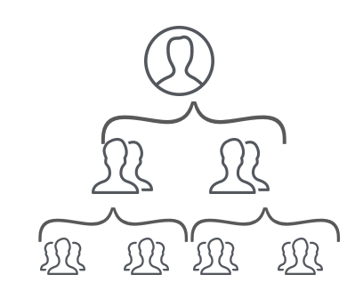
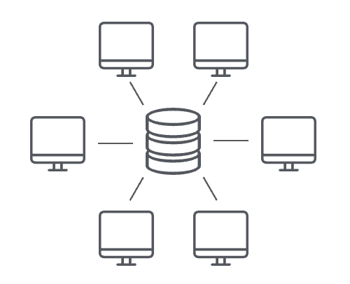

# Blockchain Course from Berkeley

Blockchain at Berkeley drives innovation in the blockchain industry by building an ecosystem that empowers students to make an impact through practical education, consulting for enterprise companies, and conducting open source research.

### Course Goals

- Granular understanding of Bitcoin
- Ability to reason about unfamiliar technologies
- Familiarity with trends & notable projects in the industry
- Confidence to pursue opportunities for contribution
- Get to know the club!

### Course Outline
- Understanding blockchain via Bitcoin
    - Overview
    - History
    - How it works
    - How it’s used
    - How it’s abused
- Blockchain beyond Bitcoin
    - Contextual knowledge in distributed systems
    - Ethereum
    - Scalability
- Guest lecture on DeFi from Xcelerator team

### Course Contents

### 01. Bitcoin Protocol and Consensus: A High Level Overview

## What is Bitcoin?

### Definitions

**Cryptocurrency:** A form of currency that’s stored completely digitally, and isn’t issued by a central authority. Made secure with cryptography, distributed consensus, and economic incentive alignment.
- Bitcoin is a cryptocurrency.

**Blockchain:** The data structure used to represent a cryptocurrency. Stores data in a way that allows multiple parties to access it reliably without having to trust one another.

### Key Characteristics of a Currency

- **Durability:** The currency does not lose value and is not destroyed or made irredeemable easily.
- **Portability:** The currency is easy to transport from place to place.
- **Divisibility:** The currency can be easily exchanged in different denominations.
- **Uniformity:** All units of the currency are identical in value.
- **Limited supply:** The supply of the currency can’t be arbitrarily inflated.
- **Acceptability:** The currency must be sufficiently widely accepted.

### Key Characteristics of a Blockchain

- **Decentralized control:** Communal consensus, rather than one party’s decision, dictates who gets to access or update the blockchain.
- **Tamper-evidence:** It’s immediately obvious if data stored on the blockchain has been tampered with.
- **Nakamoto consensus:** One has to provably spend resources when updating the blockchain.

### What is Centralization?

- Authorization handled by a single party
- Data is stored by a single party
- Think:
    - Client-server networking
    - Hierarchical org chart
    - Political dynasty
    - Central bank
    - Figurehead

 

### Centralization Pros & Cons

Pros:
- Efficiency: Data is stored in one place, programs are executed once
- Easy updates: Updates need one stamp of approval and can be force-pushed to users

Cons: 
- Lack of sovereignty: A central party may choose to use your data arbitrarily
- One point of failure: Any hack, attack, or failure only has to happen in one place

<!-- end of 01 -->
